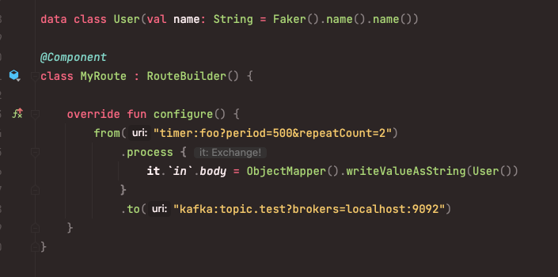
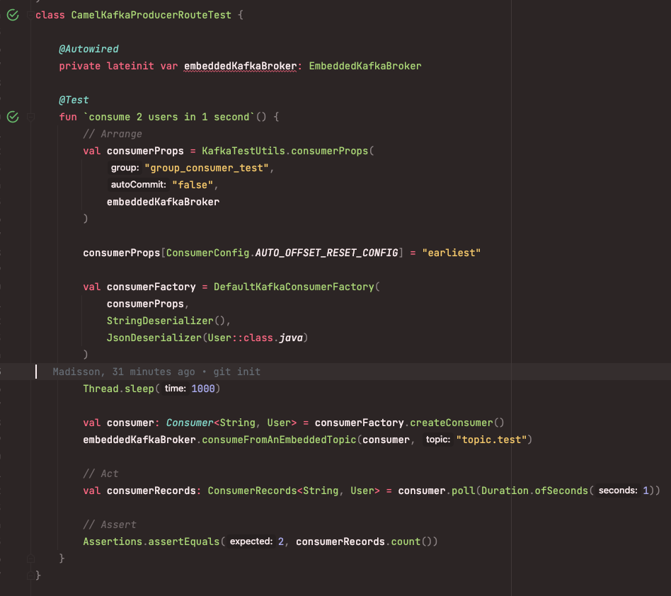

# spring-boot-camel-kafka-it-test-poc
Super minimalistic example of how apache kamel kafka module can 
be tested with Spring Boot and embedded kafka

### Test
```
./gradlew test
```

### Camel route
Gets executed 2 times with a period 500ms




### Kafka consumer test

